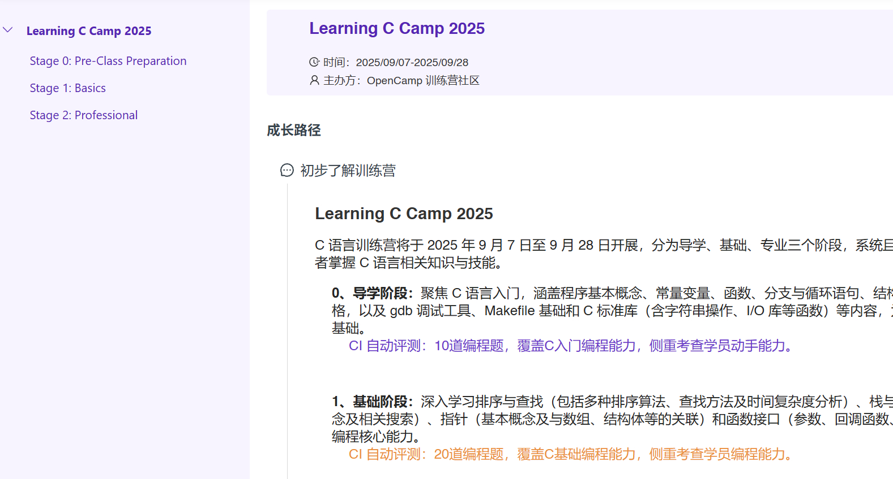
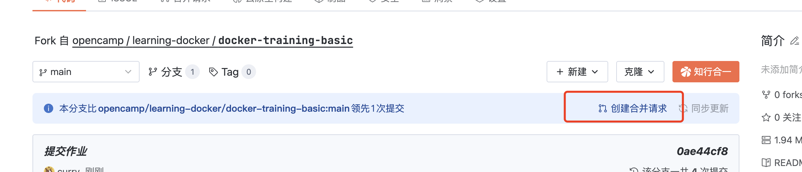
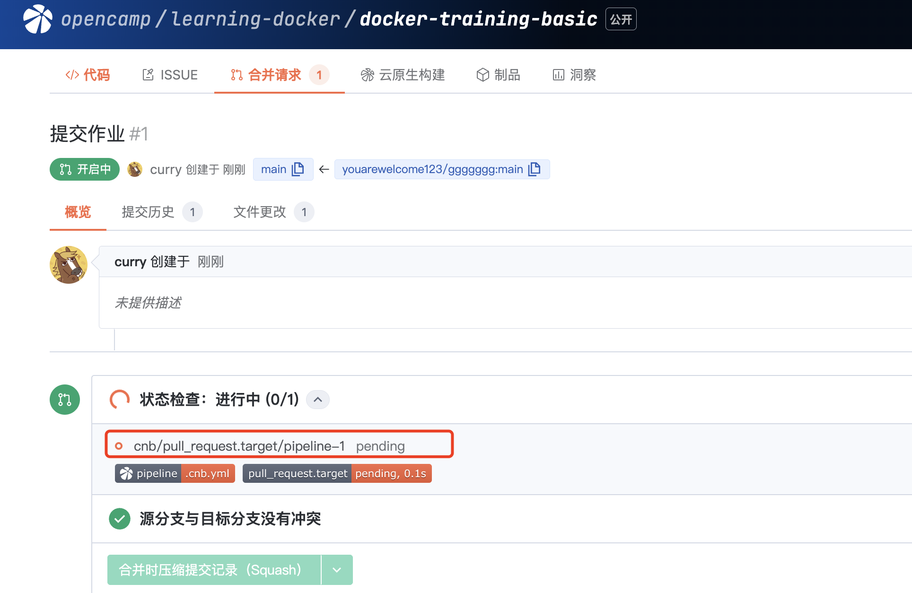
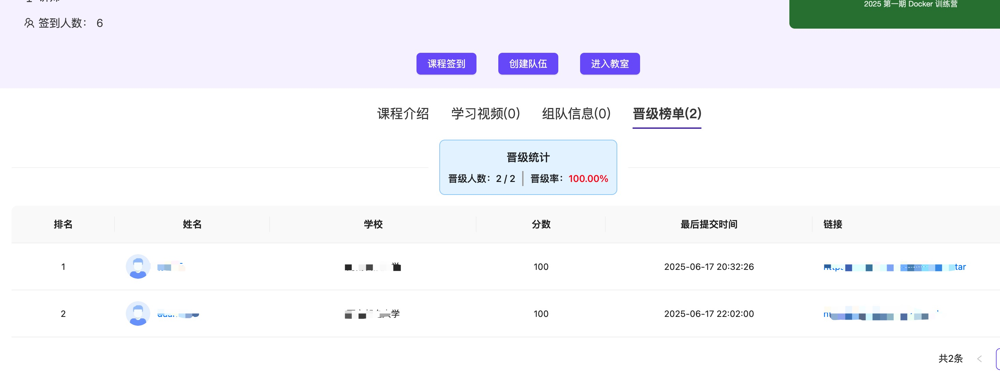

# C 语言训练营 Unit 1 — C Fundamentals

> 覆盖基本的 C 语法结构——包括变量，表达式，语句，函数，数组，结构体，位操作，指针等，学会使用状态机思想编程。

## 📚 练习题列表

06. [**06_multiplication_table** - 乘法表](./exercises/06_multiplication_table/)
07. [**07_prime_number** - 求 100 以内的最大素数](./exercises/07_prime_number/)
08. [**08_count_digit_nine** - 1 到 100 有多少个 9](./exercises/08_count_digit_nine/)
09. [**09_integer_to_string** - 整型转字符串](./exercises/09_integer_to_string/)
10. [**10_josephus_ring** - 约瑟夫环](./exercises/10_josephus_ring/)
11. [**11_point_distance** - 求两点距离](./exercises/11_point_distance/)
12. [**12_little_endian** - 判断大小端](./exercises/12_little_endian/)
13. [**13_car_restriction** - 车辆限行](./exercises/13_car_restriction/)
14. [**14_maze_exit** - 地图出路判断](./exercises/14_maze_exit/)
15. [**15_count_bits** - 统计二进制中 1 的个数](./exercises/15_count_bits/)
16. [**16_my_strcpy** - 字符串拷贝](./exercises/16_my_strcpy/)
17. [**17_word_count** - 统计单词个数](./exercises/17_word_count/)
18. [**18_my_printf** - 实现 printf](./exercises/18_my_printf/)
19. [**19_shell_parser** - 命令解释器](./exercises/19_shell_parser/)
20. [**20_preprocessor** - 预处理器实现](./exercises/20_preprocessor/)
21. [**21_lexical_analyzer** - 词法分析器](./exercises/21_lexical_analyzer/)
22. [**22_guess_number** - 猜数游戏](./exercises/22_guess_number/)
23. [**23_gomoku_game** - 五子棋](./exercises/23_gomoku_game/)
24. [**24_search_engine** - 简单搜索引擎](./exercises/24_search_engine/)

## 前置条件

- 您必须报名 [C 语言训练营](https://opencamp.ai/C/camp/2026?lang=zh_CN)

  

- 您必须在训练营个人中心完成 CNB 账号绑定

  

## 操作流程

1. Fork 本仓库，解锁作业副本。
2. 在您 Fork 的仓库中点击 **云原生开发** 按钮进入开发环境。
3. 根据文档完成 19 个 lesson 中的练习题（共 40 道小题）。
4. 完成后提交代码到 main 分支，并创建合并请求。

   

5. 在 PR 页面查看评分结果（可多次提交，每次提交都会触发评分，以最高分为准）。

   

6. 如果通过，则可以在 OpenCamp 的晋级榜单上看到自己的成绩。

   

## 云原生开发 / 本地开发

### 🛠️ 系统要求

- GCC 编译器
- Python 3.11+
- （推荐）安装 [uv](https://docs.astral.sh/uv/) 用于运行 clings

```bash
# Ubuntu/Debian
sudo apt-get update && sudo apt-get install -y gcc python3
# 安装 uv (推荐)
curl -LsSf https://astral.sh/uv/install.sh | sh

# macOS (Homebrew)
brew install gcc uv
```

### 安装 clings

```bash
# 方式 1: uvx (推荐，无需安装，隔离运行)
uvx clings init unit1
uvx clings

# 方式 2: pipx (隔离安装到独立环境)
pipx install clings

# 方式 3: pip + 虚拟环境
python3 -m venv .venv && source .venv/bin/activate
pip install clings
```

> **注意**: Ubuntu 23.04+ / Python 3.11+ 禁止直接 `pip install` 到系统环境。
> 请使用上述 uvx / pipx / venv 方式，避免 `--break-system-packages`。

### 🚀 快速开始

```bash
# 1. 初始化练习 (如果还没有 exercises/ 目录)
clings init unit1

# 2. 进入交互式 watch 模式 (保存即验证)
clings

# 3. 或者查看练习列表
clings list

# 4. 查看当前题目提示
clings hint

# 5. 查看当前得分
clings score unit1
```

### 命令参考

```bash
clings                    # 交互式 watch 模式 (默认)
clings list               # 列出练习 + ✔/• 进度状态
clings hint [exercise]    # 查看提示
clings run [exercise]     # 运行单个练习
clings check unit1        # 批量验证所有题目
clings score unit1        # 打分 (输出 JSON 报告)
clings reset <exercise>   # 重置练习文件
clings doctor             # 检查环境
clings -v                 # 显示版本号
```

## 📁 项目结构

```
Unit-1-C-Fundamentals/
├── exercises/                  # 练习题源码 (clings 格式)
│   ├── 06_multiplication_table/
│   │   ├── README.md           # 课程讲义
│   │   ├── exercises.toml      # 练习元数据 + 测试用例
│   │   └── table99.c           # 练习题 (补全代码)
│   ├── 07_prime_number/
│   └── ...
├── lessons/                    # 原始课程讲义 (NCCL 格式)
├── clings.toml                 # Unit 配置
├── .cnb.yml                    # CI 打分 + 云开发环境配置
├── Dockerfile.ci               # CI 打分环境
├── .ide/Dockerfile             # 云开发环境 (code-server)
└── README.md                   # 本文件
```

## 🔧 故障排除

1. **编译错误** — 仔细阅读编译器报错信息，检查语法
2. **输出不匹配** — 注意换行符 `\n`、空格、制表符 `\t` 是否与期望输出完全一致
3. **环境问题** — 运行 `clings doctor` 检查 gcc 和 Python 是否就绪

## 📄 许可证

MIT

---

**Happy Coding! 🚀**
